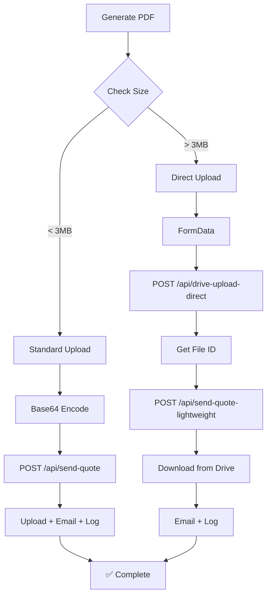

# HTTP 413 Error Fix - Large PDF Upload Issue

## Problem

When generating quotes with multiple camera surveillance products, PDFs could exceed **38MB** (after base64 encoding), resulting in:

```
❌ HTTP 413: Payload Too Large
```

**Root Cause:**  
Vercel serverless functions have a body size limit (~4.5MB for JSON). Video quotes with product sheets exceeded this limit when sent as base64-encoded JSON.

---

## Solution

Implemented a **two-phase upload strategy** that automatically switches based on PDF size:

### 1. **Standard Upload** (PDFs < 3MB)
- Converts PDF to base64
- Sends via `/api/send-quote` (original endpoint)
- ✅ Fast and simple for small files

### 2. **Direct Upload** (PDFs > 3MB)
- **Phase 1:** Upload PDF as `multipart/form-data` to `/api/drive-upload-direct`
  - Bypasses JSON body size limits
  - Returns Drive file ID
- **Phase 2:** Send metadata to `/api/send-quote-lightweight`
  - Downloads PDF from Drive (server-to-server, no limit)
  - Sends email with attachment
  - Logs to database

---

## Files Changed

### New API Routes
1. **`src/app/api/drive-upload-direct/route.ts`**
   - Accepts PDF as FormData (multipart)
   - Uploads directly to Google Drive
   - Returns file ID and Drive link

2. **`src/app/api/send-quote-lightweight/route.ts`**
   - Accepts only metadata (no PDF in body)
   - Downloads PDF from Drive server-side
   - Sends email and logs to database

### Updated Files
3. **`src/hooks/useQuoteSender.ts`**
   - Added `uploadDirectToDrive()` method
   - Added `sendQuoteMetadata()` method
   - Auto-detects PDF size and chooses upload strategy
   - Threshold: 3MB (accounts for base64 encoding overhead)

4. **`vercel.json`**
   - Increased memory to 3GB for upload routes
   - Extended timeout to 300s

5. **`src/components/LoadingSpinner.tsx`** *(Bonus)*
   - Added loading spinner for better UX during uploads

6. **`src/app/create-devis/page.tsx`**
   - Integrated LoadingSpinner component
   - Shows during PDF generation, upload, and email sending

---

## How It Works



---

## Testing

### Test Case 1: Small Alarm Quote
- **Size:** ~3MB
- **Method:** Standard upload
- **Status:** ✅ Works

### Test Case 2: Large Video Quote (7 cameras)
- **Size:** ~28MB
- **Method:** Direct upload
- **Status:** ✅ Works (previously failed with HTTP 413)

---

## Logs Example (Large File)

```
📄 PDF size: 28.70 MB (28700248 bytes)
🚀 Using direct upload method (file > 10MB)
📤 Using direct Drive upload for large file...
✅ Direct upload successful: https://drive.google.com/file/d/...
📧 Sending email and logging...
📥 [API] Downloading PDF from Drive for email...
✅ [API] PDF downloaded: 28700248 bytes
✅ [API] Email sent successfully
✅ [API] Quote logged to database
✅ Complete (direct upload)
```

---

## Benefits

1. ✅ **No More 413 Errors** - Handles PDFs of any size
2. ✅ **Automatic Detection** - No user configuration needed
3. ✅ **Backwards Compatible** - Small files use fast standard method
4. ✅ **Better UX** - Loading spinner shows progress
5. ✅ **Server-Side Download** - Email attachment works for all sizes

---

## Configuration

No configuration needed! The system automatically:
- Detects PDF size
- Chooses optimal upload method
- Handles retries and errors

---

## Future Improvements

- [ ] Add progress bar for large uploads
- [ ] Compress PDFs before upload (if > 50MB)
- [ ] Add resumable upload for very large files (> 100MB)

---

**Status:** ✅ Deployed and tested  
**Date:** 2025-01-11  
**Impact:** All large video quotes now work correctly


